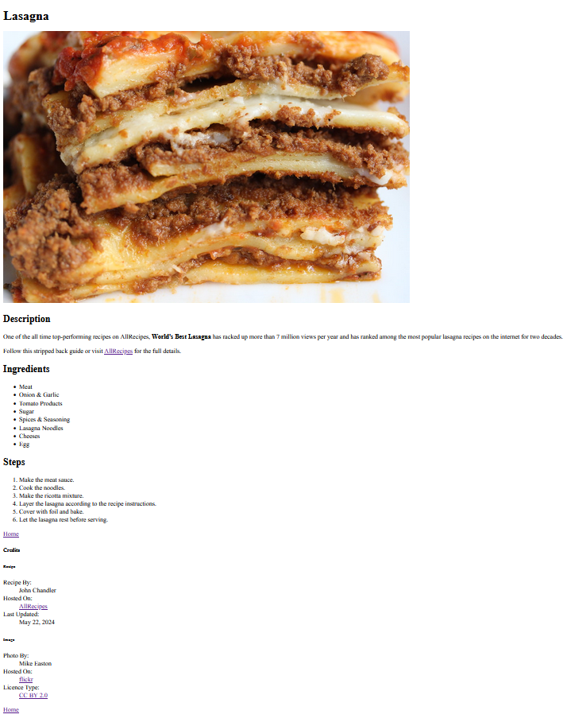

# Project: Recipes

A demonstration of basic `HTML` used to create a simple multi-page website that displays a few recipes.

- Built based on the assignment instructions from the **HTML Foundations** section of the **Foundation Course**
at [TheOdinProject](https://www.theodinproject.com).
- Does not include any styling - only `HTML` is on display.

---

## Assignment

For full instructions for the assignment [click here &rArr;](./assignment.md)

## Result

For a full live preview of the finished site in all its unimpressive, unstyled glory [click here &rArr;](https://pw80.github.io/odin-recipes/)

Alternatively, please enjoy this image of an example page:

